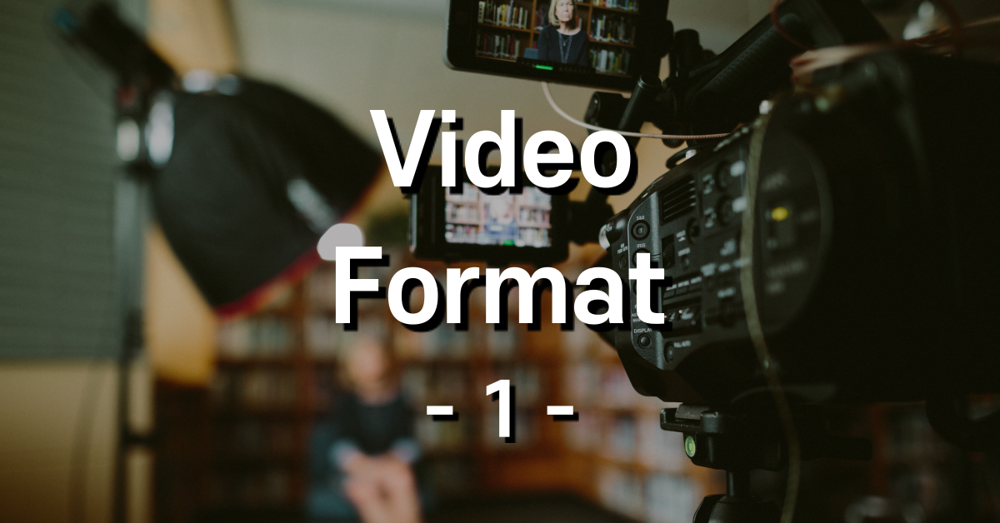

  지금부터 나오는 이론은 '이것도 모른다면 대체 영상을 왜 하려고 하니?'를 스스로에게 되물어야 할 만큼 아주 기초적인 것이니, 가벼운 마음으로 쓱쓱 읽되 내가 몰랐던 건 필히 킵하고 가시길 바랍니다

 

## Video Format  

 이 설정을 통해야만! 영상 편집이 '시작'된다고 볼 수 있습니다. 이걸 모르면 맨~ 처음 설정부터 머리가 아프기 시작하면서 영상을 때려치는 불상사가 발생합니다.

 

### 화면 사이즈(Resolution)

 

- SD

> - NTSC (480 Lines 60i, 30p)
> - PAL (576 Lines 50i, 25p)

  미국과 우리나라는 NTSC 방식을 채택. 유럽에서는 PAL 방식을 채택하고 있습니다.

 

- HD

> - 720p (1280x720)
> - 1080p (1920x1080)
> - 1080i (1920x1080)

  요즘 TV로 옛~~날 무한도전을 보면 좌우에 필러박스(송출 영역 제외한 좌우 여백)를 확인할 수 있습니다. 그러다 HD 이상 출력되는 TV와 방송 송출이 가능해지면서 오늘날의 예능을 시청할 수 있게 됐죠.  

  720p의 특징은 HD 60프레임 방송이 가능했다는 점입니다. 화질은 다소 떨어지지만 송출력은 높은 특징을 가지고 있습니다.

> Q. 그럼 왜 화면 사이즈가 점점 커질까요..?
>
> A. 제조사에서 디스플레이가 큰 제품을 찍어내니까..

  참고로 FHD(풀 HD라 하는)는 용어(?)는 디스플레이 제조 회사가 만든 개념이고 정식 용어는 아니라고 합니다. 혹시 본인이 타인의 멘트에 지적질하기 좋아하는 꼰대라 자부하신다면 누군가 FHD 언급할 때 대놓고 면박주면 우왕굳.

 

- UHD

> - 4K (3840x2160)
> - 5K (5120x2700)
> - 8K (7680x4320)

(4K는 3840인 가로 사이즈가 4천에 근접했다고 하여 4K라 부른다 합니다.)

  기기는 고도화 됐는데 아직 모든 방송이 저 기기에 적합한 송출력을 가지고 있느냐..는 의문이 듭니다. 당장 매장에서 튼 초고화질 영상은 기기를 팔기 위해 제작한 영상이니 말이죠. 아마 큰맘 먹고 질렀는데 집에 와서 내가 보던 드라마 보면 상당히 흐릿한 것이 심심하고 픽셀도 다소 깨져보이는 듯한 느낌적인 느낌이 들 겁니다.

  뭐.. 방 안에서 좁디 좁은 모니터로 볼지언정 블루레이를 모으던 이치랑 같지 않겠습니까? 영상 화질은 심심해도 화면은 광화문만한 사이즈로 보겠다 하시는 분들 이해해 줍시다.

  참고로 영화관에서 보는 아이맥스는 16K 정도 된다고 합니다.

---

 

### Scan Method

 

- Interlaced Scan (ex. 1080i)

  이름에서 알 수 있듯이 짝수랑 홀수장을 빠르게 교차하며 보여주는 것을 의미합니다. 기술이 살짝 떨어지던 시절에 사용하던 방식인데.. 비교적 용량이 작은 것이 장점이었지만, 화질이 다소 떨어지는 단점이 있죠.

> Field

 이 방식에서 아주 중요한 용어입니다. 예를 들어 50i라 함은 **'초당 50 필드를 찍었다'**는 것을 말합니다. 필드는 홀짝의 개념으로 프레임의 1/2 수치인데.. 50i 라는 것은 체감상 25프레임이라는 것을 의미하죠.

  홀에 해당하는 odd와 짝에 해당하는 even으로 구성되어 있습니다.

 

- Progressive Scan (ex. 1080p)

 Interlaced Scan 방식과 다르게 필름 촬영 방식에 근거합니다. 화질이 좋고 용량이 큰 단점(?)이 있는데, 요즘은 저장 장치 용량도 매우 크고 상대적으로 가격도 저렴해졌기 때문에 사실상 단점이 없다고 보면 됩니다.

 얘기가 길어질 것 같으니 Frame Rate 부터는 다음 포스팅에..
