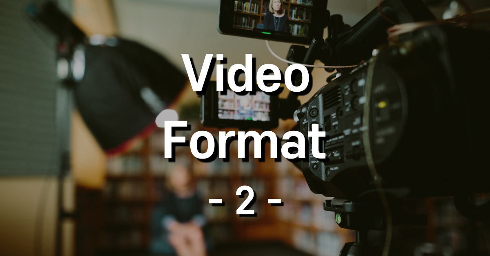
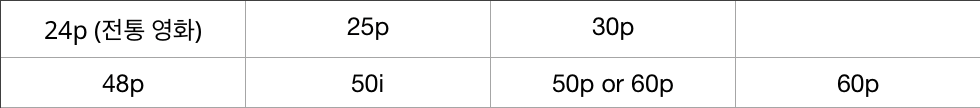
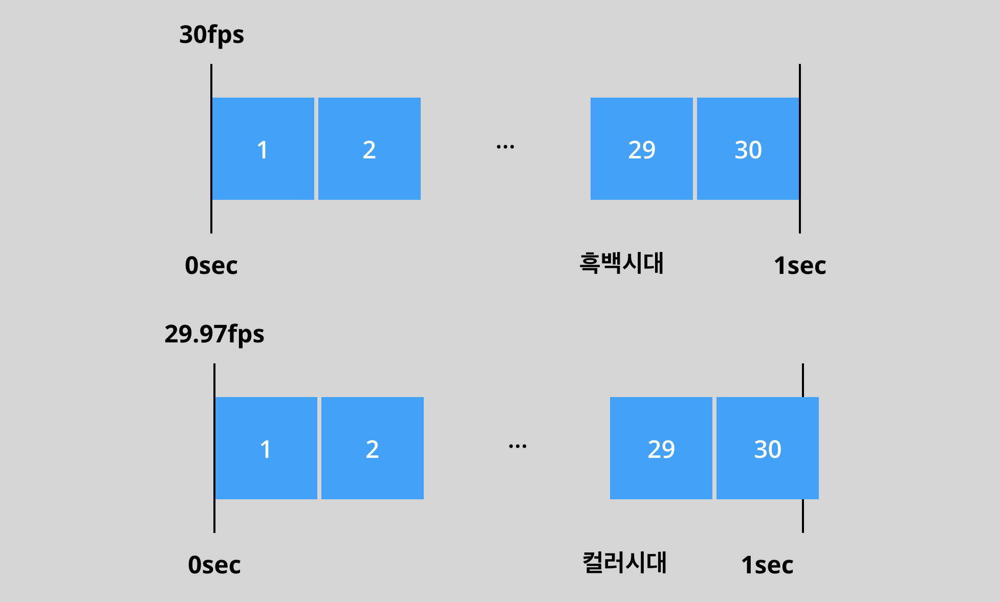
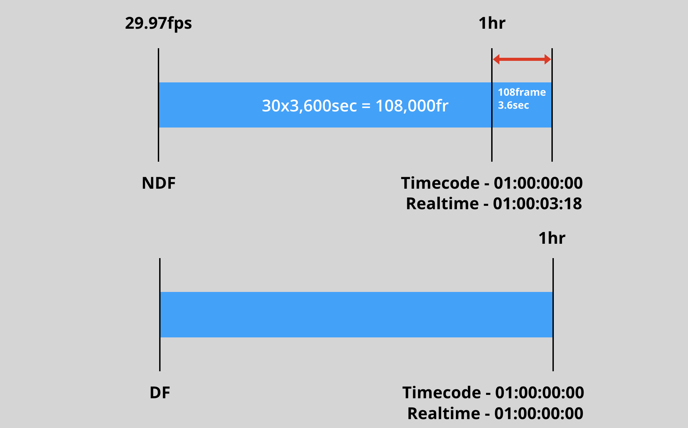
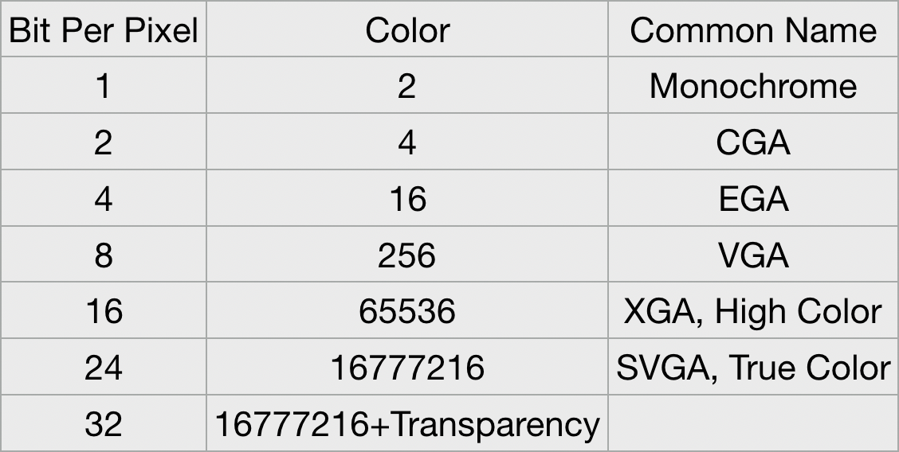

  참고로 이건 Video Format 두 번째 시간입니다. 첫 번째 포스트를 아직 열람하지 못하신 분들은 황급히 뒤로가기를 눌러 순서에 따라 내용을 확인하시기 바랍니다. 이미 영상이론에 대해 빠삭하다 자부하는 분들은 마우스를 내려놓고 이 페이지에서 나가 주시기 바랍니다.

 

### Frame Rate(초당 몇장을 찍었는가)

 오며 가며 29.97fps, 30fps 등 Frame Rate에 대한 다양한 값들을 구경은 했을 겁니다. 제목에 설명한대로 30fps는 초당 30장을 찍었다는 이야기입니다. 바꿔 말하면 30장의 프레임이 모여 1초의 영상을 구성했다는 이야기죠.

  Frame Rate에 대한 값은 이렇게 다양합니다. (i에 관한 부분은 이전 포스트의 Interlaced Scan 부분을 참고) 촬영 단계부터 용도에 맞게 적절한 프레임 레이트를 설정해야, 깔끔한 작업에 도움이 되겠쥬?

  참고로 전통 영화가 24p를 쓰는 이유는 **1) 필름 값 2) 거친 느낌** 때문이라고 합니다

> - 29.97 (30p)
> - 59.94 (60p)

  (아마도 초기 세팅 때 가장 많이 만날 두 친구.. ㅎㅎ)  

이 두 친구를 **방송용** Frame Rate라 합니다. 우리에게 아~주 익숙한 720p 화질부터 60프레임 송출이 가능해졌는데요! 59.94 방식을 쓰는 거라고 보면 됩니다.

+@ 120p or 240은 슬로우모션 용입니다. 초당 프레임 수가 많아야 길~~게 늘일 수 있다는 개념..!

 

* Drop Frame

  Drop Frame이란 원래 **'끊겨 보인다'** 는 의미입니다. 그런데 왜 드랍 프레임을 쓰는 걸까요? 이유는 Timecode 방식 때문인데.. 바로 설명해 드릴게요?

 

* Timecode

> 00:00:00:00 (시:분:초:프레임)

  영화는 24 프레임이라고 했쥬? 그럼 1~23프레임이 지나고 다음 24번 째 프레임이 되는 순간! 1초가 되는 겁니다.

  NDF(Non Drop Frame)로 1시간을 촬영하면 타임 코드로는 1시간이 찍히지만 실제로 촬영한 시간은 01:00:03:18이 됩니다.

  여러분이 방송국과 협업할 일이 생겨서 NDF로 촬영한 방송분을 넘겼는데, 실제 방송 러닝 타임 기준 1시간으로 자르면? 뒤에 3초 18은 스무스하게 삭제됩니다. 우리가 Frame Rate에 대해 정말 간단한 배경지식은 알아놔야 하는 이유를 아시겠죠?

  영상 촬영 및 제작시 29.97fps 을 쓰려거들랑 무!조!건! Drop Frame Timecode를 쓰도록 합시다. 같은 이유로 영화나 드라마에서도 24가 아닌 23.98fps를 쓴다고 하니 알아두시면 좋을 듯

> 요약 결론 : 29.97과 23.98을 가장 많이 쓰고 DFT 설정해야 시간이 딱 맞는다

---

 

* Bit Depth

 비트맵 이미지나 비디오 프레임 버퍼수 또는 하나의 픽셀의 각 색요소를 위해 사용되는 비트 수를 말합니다.

  우리가 흔히 말하는 '24 트루컬러'는 영상이나 이미지에서 8비트에 해당합니다. 이건 무슨 조화일까요? 여기서 힌트

> 이미지를 구성하는 3원색은 R.G.B (빛의 3원색)이다.

  그렇습니다. 비트 뎁스가 8비트면 x3 한 것이 컬러 값이 되는 것을 의미합니다. 대부분의 카메라는 8비트라고 하네요?

  그럼 왜 점점 높은 비트로 영상을 촬영하고 제작하려는 걸까요? 이유는 색보정이나 합성에 유리하기 때문입니다. 프레임 수가 많으면 슬로우 모션 제작하기 용이한 것과 같은 이치입니다.

> 고품질 = 후보정 용이

  컬러 그레이딩 하지 않을 거면 굳이 10비트가 필요하지 않으니 참고하시기 바랍니다.

  Codec 부터는 다음 포스트에..
