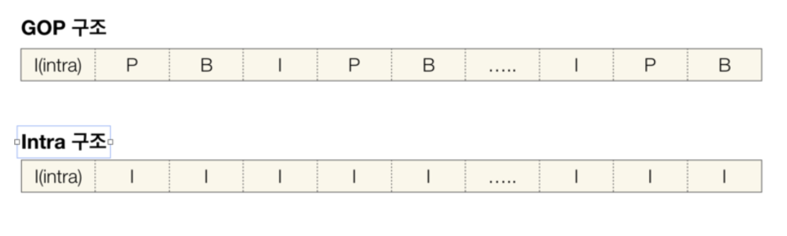
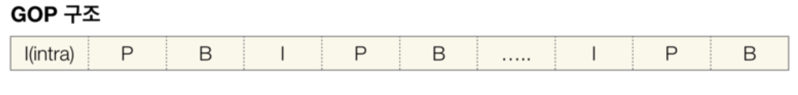
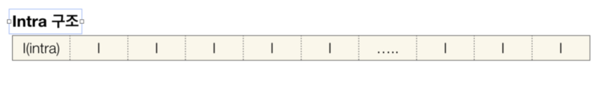
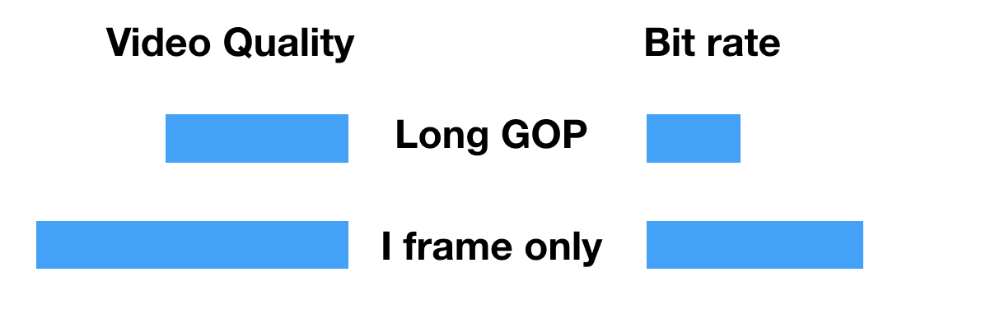
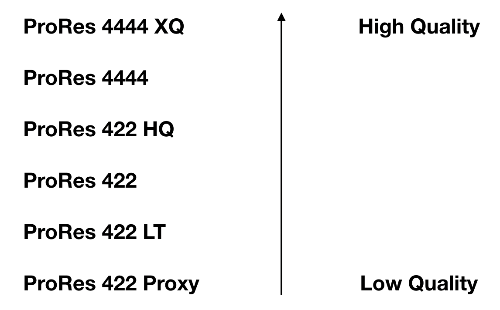

  언제나 이론은 재미가 읎죠? 사실 저도 그런데.. 이것만 끝내고 얼른 파컷 초간단 매뉴얼로 넘어가도록 할게요 ^^

 

### Codec

<blockquote>
  Compressor + Decompressor의 합성 및 줄임말
</blockquote>

  영상은 무조건 손실과 압축의 과정을 거칩니다. 만약 영상이 Uncompressed 된 상태라면.. 무압축 1080이 1초에 1기가 정도의 용량을 자랑(?)한다고 하니까..! 이걸 돌리다가 여러분의 소중한 맥이 뻗어버리는 대참사가 벌어지겠죠?

> 손실 = 화질 악화

  를 의미하지만 압축이 꼭 필요한 이유가 바로 이것입니다. 영상을 압축한다고 할 때는 보통 '색 정보'를 압축한다는 의미이고, 이 손실률을 줄이는 것이 영상 관련한 회사들이 가지는 지상 목표라고 할 수 있죠.

 

* Digital Container Format (Wrapper Format)

  여기서 잠깐..! 영상 파일을 보면 제목 뒤에 Quicktime(MOV), AVI, MKV, MP4, AIFF, WAV 등등 이런 것들이 붙죠? 이게 바로 코덱이 아니고 콘테이너입니다. 낚이면 안 돼요..?

  다시 코덱으로 돌아가면

요로코롬 GOP vs Intra Compression이 있습니다. 바로 밑에서 따로따로 설명해 드리죠.

 

* GOP(Group of Pictures) Compression

  위의 그림을 보면 I, P, B가 있죠?

> I = Intra - Coded Frame
>
> P = Predictive - Coded Frame
>
> B = Bidirectional - Coded Frame

  여기서 인트라 영상의 모든 픽셀 정보를 가지고 있는 프레임이라고 보면 된다. P와 B는 변한 부분에 대한 프레임을 의미하는데..

  정리해서 말하자면 I를 복사해서 P 그리고 B와 합성하는 방식이라고 보면 됩니다. 용량이 매우 작고 (비교적) 화질이 떨어지는 특징이 있습니다. 프레임 단위로 컴퓨터가 연산을 해야하기 때문에 편집에는 최악인 방식이라고 할 수 있습니다.

  대표 코덱으로는..

> 1. AVCHD (MPEG-4/H.264)
> 2. HDV
> 3. MXF

  가 있고 '출력 용도'의 코덱입니다. 압축률이 굉장히 높은 특징이 있어요!

 

* Intra Compression

  전부 다~ Intra 프레임만 있는 경우입니다. 이 말인 즉슨! 용량이 무지~하게 크지만 컴퓨터의 연산 몫이 줄어 '편집'에 유리하다는 말이기도 합니다.

  대표 코덱으로는..

> 1. DVCPRO HD
> 2. ProRes
> 3. AVC - Intra

  대부분의 카메라가 GOP 방식을 따르고 있고, 이 말은 편집 때 컴퓨터에게 부담을 주지 않으려면 '컨버팅'이 필요하다는 것을 의미합니다.

 

* ProRes

  애플느님이 만든 코덱이고 전세계적으로 극찬 받는 바로 그 코덱..! 심지어 어도비도 사서 쓰는 명품 코덱

  대략 요런 구성입니다. 보통 작업할 때는 422를 가장 많이 쓰고 '사둘둘'이라고 부릅니다. 제일 밑에 있는 Proxy의 경우는 원본의 50% '퀄리티'인데, 어떨 때 사용하느냐! **멀티캠** 작업에 사용합니다.

> ex. 효리네 민박 같은 편집량 과다한 고화질 관찰형 예능

  혹은 개인이 덕질하는 수준에서는 멀티캠을 가장 많이 사용하는 아이돌 무대 '교차편집' 정도..?

 요는 고화질 다량의 소스를 작업할 때 프록시로 했다가, 출력은 고퀄 코덱으로 하시는 것을 추천

---

 

자 여기까지 정말 간단하고 짧은(?) 영상 이론이었고 3개의 문서를 종합해서 요약해 드리자면..

> 1. 화면 사이즈
> 2. Interlaced vs Progressive (Scan Method)
> 3. Frame Rate
> 4. Bit Depth
> 5. Codec

 이 순으로 큰 개념들 간단하게 정리해두시고, 관련해서 구글링 하다 보면 모르는 용어를 추가로 정리해 두면 온갖 설정, 경고 메시지 등에 당황하지 않을 수 있습니다.

  다음 시간부터는 본격 '파이널컷 X 초간단 매뉴얼' 들어가도록 하겠습니다.
