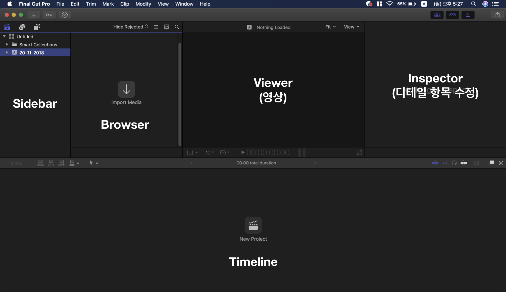
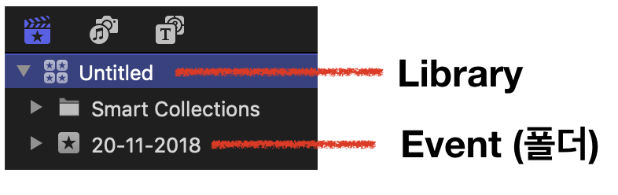
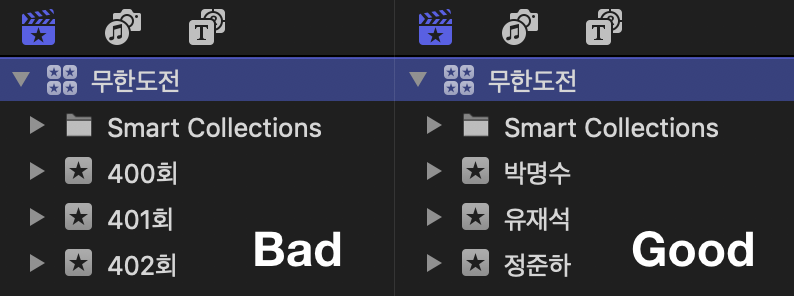
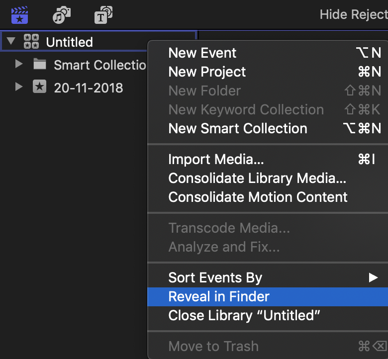
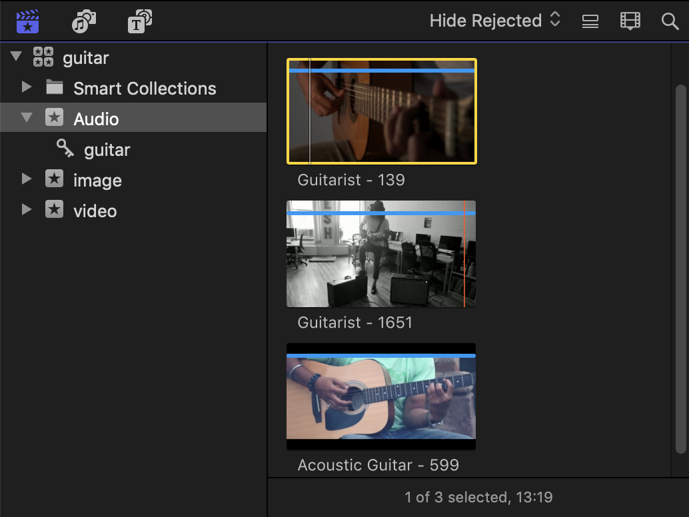
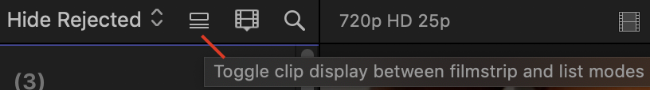
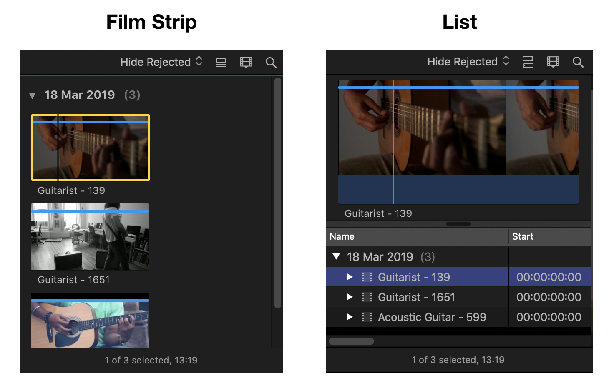
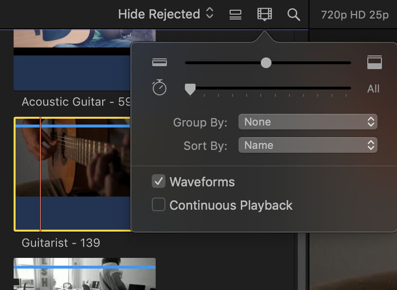
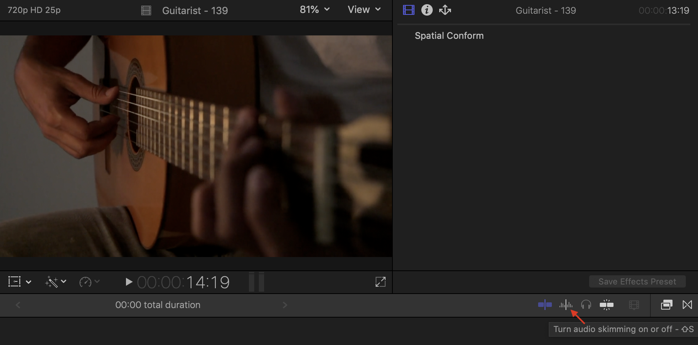
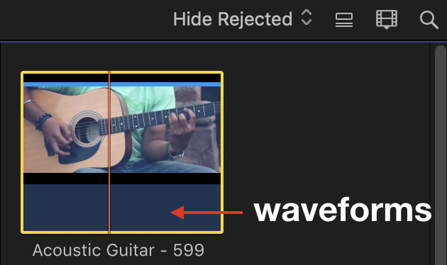

  파이널 컷 프로의 장점 : Mac과 연동이 잘 된다. 영상 프로그램 중 최적화는 갑

  파이널 컷 프로의 단점 : 일단 Mac을 사는데 지갑 탈탈탈

 

### 인터페이스 구성

  각 영역을 부르는 이름입니다. 이걸 반드시 알아둬야 하는 것이.. 나중에 분명 협업 비스무리한 것을 할 텐데, 그 때 가서 "그 맨 왼쪽 상단에 거기 제목 적는 세 번째 칸 있잖아요?" 하면 을매나 읎어 보이겠어요.. ㅜㅜ

 

#### 1. Sidebar

  좌측 최상단에서 제목, 키워드 등을 분류해 놓은 영역을 사이드바라고 합니다. 여기서 같이 알아둬야 할 '파이널 컷 프로'의 분류 체계가 있는데..

 

  여기서 Library란 '파이널 컷 프로'의 '저장 단위'를 말합니다. 특이한 점은 프로그램 안에서 삭제는 되지 않고 Open/Close 만 가능합니다. 윈도우 프로그램에 익숙해져 있다면 다소 생소한 체계일테니 적응 안 되시는 분들은 맥에 대해 먼저 학습을 간단하게 하시고 사용하시는 걸 추천..!

  그리고 필히 영상 제작 시작할 때 라이브러리의 이름을 정해야 합니다. 혹여나 어디에 영상이나 Xml 제출시에 ‘Untitled 1’라는 작태가 적발된다면.. 그 자리에서 입구컷을 당하게 될 겁니다.

  그리고 여기서 정말 중요한 포인트!

  

(하나의 이벤트 안에 여러 이벤트 만들기 금지)

  이게 무슨 말인고 하니.. 여러분이 만약 무한도전을 편집한다고 치면? 하위 폴더인 이벤트에는 세부 갈래로 소스를 분류해야지, 여기에 또 다시 라이브러리급 개념을 넣으면 '분류'의 ㅂ도 모르는 사람이 됩니다.

  그런데 라이브러리를 삭제하지 못한다면 영원히 저장 공간 안에서 살아 숨쉬는 괴물이 되는 걸까요..?

   

는 무슨.. 해당 라이브러리가 있는 폴더를 열어 삭제해 주시면 됩니다. 윈도우의 '폴더 열기' 같은 개념이라고 보면 되겠네요.

 

#### 2. Browser

  쉽게 얘기하자면 우리가 분류해 놓은 소스들을 확인할 수 있는 영역입니다. Import의 사이드 바에서 드래그 해서 등록 가능하고, 가급적 폴더 단위로 불러오는 것을 추천 드립니다.

 

* Film Strip / list

  파이널 컷은 해당 버튼에 마우스 오버를 하게 되면 '이것은 ~~에 쓰이는 기능입니다'를 아주 친절히 알려줍니다. 첨부된 이미지에 있는 문구는 대략 '필름 스트립 방식과 리스트 방식으로 볼 수 있어요~'라는 뜻인디

 

어떤 차이인지는 가장 직관적인 '이미지'로 설명을 줄이겠습니다.

 

* Clip Appearance

  필름 스트립/리스트 바로 우측에 있는 버튼입네다.

> 1. 브라우저에 띄운 자료들의 크기 조절
> 2. 시간 단위 조절

 

분류한 소스들을 더 자세히 볼 수 있게 커스텀 하는 영역이라고 볼 수 있죠. 여기서 소스들에 마우스 오버를 하고 이리저리 움직이면 해당 영역이 빠르게 play되는 것을 볼 수 있는데.. 이를 '스키밍'이라고 부릅니다. 대략적인 편집점이나 영상의 내용을 미리 확인할 수 있는 초특급 꿀 기능!

  만약 여기서 오디오 스키밍 소리가 너무 조잡스럽고 거슬린다..! 하시면

  ’Turn Audio Skimming ~~’ 부분을 off 해주면 간단히 해결 (위치는 인스펙터 하단 부분)

 

  그리고 브라우저에서 하단의 웨이브폼을 통해 '대략 어떤 볼륨이나 소리를 갖고 있는지' 확인할 수 있습니다. 자료로 쓴 영상은 픽사베이에서 받은 건데, 오디오가 아예 없는 영상이었어요. 해서 웨이브 폼 영역이 공허함으로 남아 있습니다.

  여튼 여기서 웨이브 폼을 언급한 이유는.. 영상 원본의 볼륨 설정을 적절하게 마친 후 편집에 들어가는 것이 중요하기 때문입니다.

>   Cotrol + [+/-]

  이게 볼륨 조절 단축키니 마우스로 대~충 드래그해서 조절하지 말고 세세하게 조절하시길 바랍니다. 참고로 키보드 사용시 숫자 패드에 있는 +/-는 사용하지 마시는 것을 추천. 입력이 이따금씩 안 되는 문제가 있습니다.

여기까지가 Library 생성 - Import - 자료 스키밍 - Event 분류의 과정이었고, 키워드 분류 부터는 다음 포스트에..
