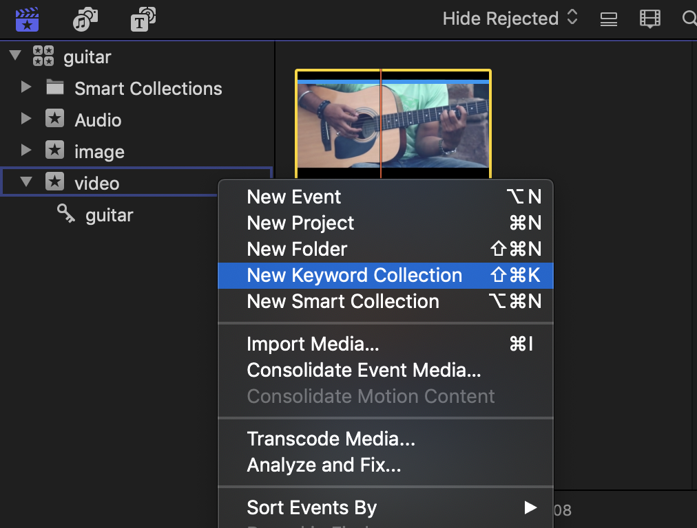
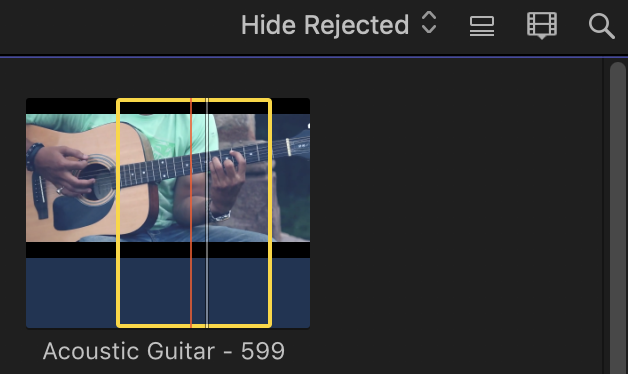
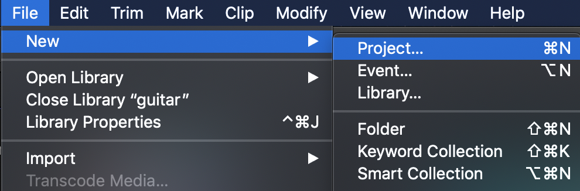
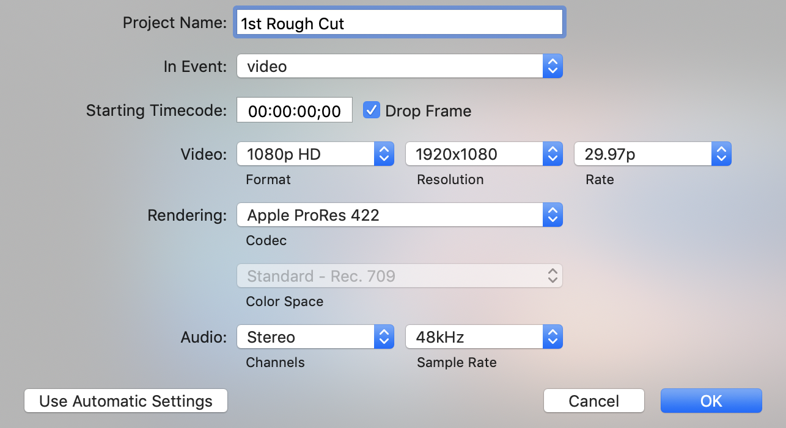
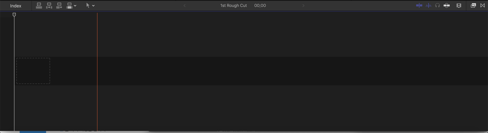
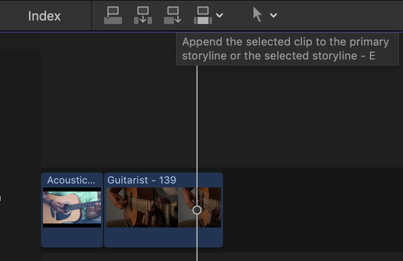

  파이널 컷 프로의 장점 : 쉽다. 직관적이다

  파이널 컷 프로의 단점 : 왜 쉽다는데 난 잘 못 쓰니..?

 

* New Keyword Collection (핵중요)

  라이브러리 안의 라이브러리는 안 된다고 지난 시간에 엄중 경고(?)한 바 있습니다. 그럼 이벤트 안에 이벤트 생성은 됩니까? 라고 물으신다면..

  당연히 안 되니까 이런 말도 안 되는 질문을 했겠죠? 그럴 땐 요로코롬 '키워드' 분류를 해주면 됩니다.

 

 그런데 이 키워드는 분류는 소스의 '부분'도 가능합니다. 쓰고자 하는 부분의 시작에서 'i'를 마지막 지점에서 'o'를 눌러주시면(In&Out의 약자가 곧 단축키) 첨부한 이미지처럼 소스 내에서 사용할 부분만 체킹이 됩니다. 그리고 이 부분만 Keyword Collection도 가능하다는 말이죠.

---

 

### Project

 소스 분류하는 방법을 알았으니 추가적으로 영상 관련 세팅을 해주신다면 영상 편집 시작이 가능하겠죠?

  해당 경로로 시작하면 됩니다. 역시 텍스트보다는 이미지로 설명하는 것이 우왕굳..

 

  자..! 여러분..! 이 프로젝트 설정값 때문에 그 길고 지루한 영상 이론들을 배운 겁니다!

  만약 프레임 레이트 29.97p 써놓고 위에 Drop Frame 설정 안 했으면 마지막 멘트가 과감히 삭제되는 대참사가 벌어질 뻔했쥬?

  여기서 Rendering은 그 때 그 때의 최종본을 이르는 말입니다. 파컷은 작업 틈틈이 해당 과정을 렌더링 하는 특성을 가지고 있쥬. 코덱은 표준인 프로레스 422를 선택해줍니다.

 그리고 제목은 제발 직관적이고 상세하게 적읍시다. 최종 진짜최종 최최종 더이상 ㄴㄴ

 

### Storyline

  프로젝트를 생성하면 타임라인 센터에 진한 줄이 생성됩니다. 여길 기점으로 스토리라인을 짜고 편집이 시작되는 것이죠. 프로젝트 생성 안 하면 활성화되지 않는 영역이니 '어우씨 이거 왜 안 생겨!' 하시면 아니되옵니다.

 

  그렇게 대략적인 분류와 세팅이 끝나면 이제 'Append'라 불리는 바로 뒤에 이어 붙이기를 통해 영상 편집을 시작한다고 보면 됩니다 ^^

 다음 포스팅에서 '분류'에 관한 정산과 함께 본격적인 기본 편집에 대해 다룰테니 많이 기대해 주세요..?